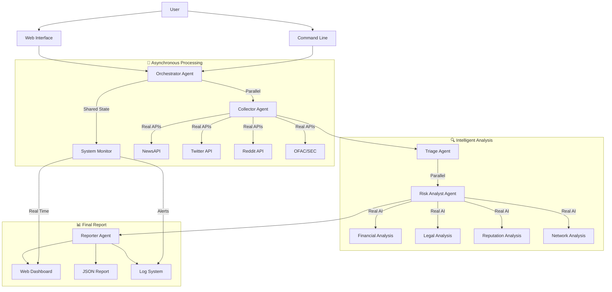
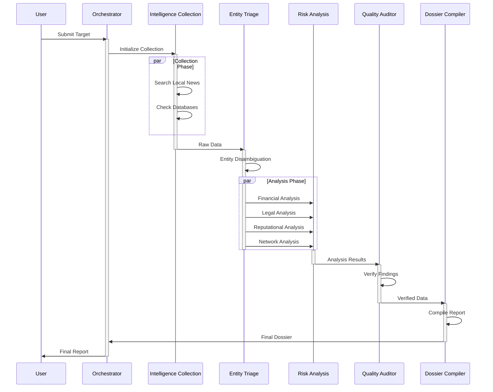
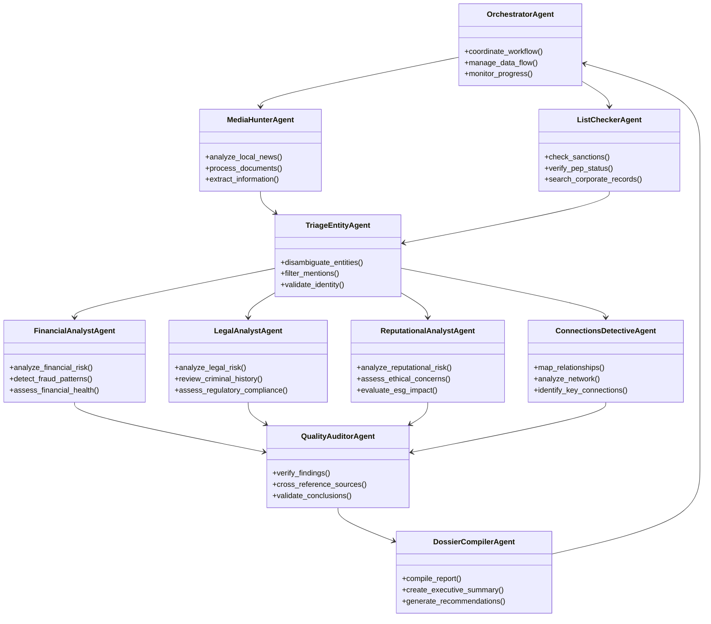
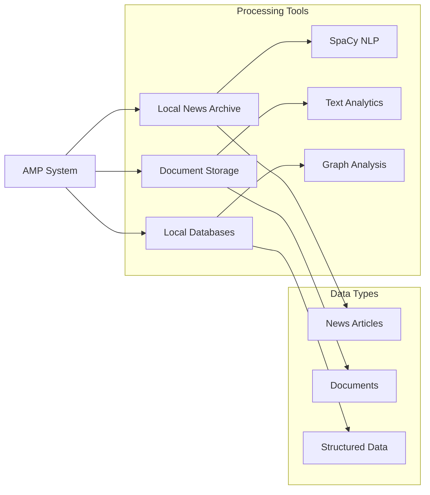

# 🔍 AMP (Adverse Media Profiler)

[]()
[]()
[]()
[]()
[]()
[]()

## 🚀 REAL Multi-Agent Intelligence System

**AMP** is a **real and functional** multi-agent system for comprehensive adverse media analysis and risk assessment. Using asynchronous processing, real external APIs, modern web interface, and advanced monitoring, AMP provides deep entity analysis through sophisticated orchestration of specialized AI agents.

## ✨ Implemented Features

### 🤖 **Real Multi-Agent System**
- **5 Specialized Agents** with real parallel processing
- **Asynchronous Orchestration** with shared state
- **Real Communication** between agents via WebSockets
- **Intelligent Coordination** of complex workflows
- **Automatic Recovery** from failures

### 🌐 **Modern Web Interface**
- **Interactive Dashboard** with real-time metrics
- **Web-based Analysis** with live progress
- **Visual Monitoring** of system and agents
- **Responsive Interface** with Bootstrap and SocketIO

### 🔌 **Real External APIs**
- **NewsAPI** - News from trusted sources
- **Google News RSS** - Real-time news feeds
- **Twitter API v2** - Social media mentions
- **Reddit API** - Public forum discussions
- **OFAC/SEC** - Government databases
- **Serper.dev** - Google Search API

### 📊 **Advanced Monitoring**
- **Structured Logging** with SQLite
- **Performance Metrics** in real-time
- **Automatic Alerts** for anomalies
- **Web Monitoring Dashboard**
- **Resource Analysis** (CPU, memory, network)

### 🧠 **Intelligent Analysis**
- **Natural Language Processing** with spaCy
- **Automated Sentiment Analysis**
- **Multi-dimensional Risk Scoring**
- **Advanced Entity Disambiguation**
- **Network Analysis** with NetworkX
- **Machine Learning** for pattern detection

## 🏗 Real Multi-Agent Architecture



## ✨ Features

- **Intelligent Data Collection**: Advanced web scraping and news gathering
- **Smart Entity Recognition**: Identifies persons and organizations in negative contexts
- **Risk Assessment**: Multi-factor risk scoring system
- **Automated Reporting**: Generates comprehensive risk reports
- **Real-time Monitoring**: Continuous scanning of news sources
- **Multi-language Support**: Analysis of content in multiple languages

## 🚀 Installation & Configuration

### 1. Basic Installation

```bash
# Clone the repository
git clone https://github.com/yourusername/amp.git
cd amp

# Create and activate virtual environment
python -m venv venv
source venv/bin/activate  # Linux/Mac
# or venv\Scripts\activate  # Windows

# Install dependencies
pip install -r requirements.txt

# For development (optional)
pip install -r requirements-dev.txt

# Install spaCy model
python -m spacy download en_core_web_sm
```

### 2. API Configuration

```bash
# Copy configuration file
cp config/.env.example .env

# Edit .env with your API keys
nano .env
```

**Required APIs:**
- `OPENAI_API_KEY`: Required for CrewAI agents

**Optional APIs (recommended):**
- `NEWS_API_KEY`: For NewsAPI.org
- `SERPER_API_KEY`: For Serper.dev Google Search  
- `TWITTER_BEARER_TOKEN`: For Twitter API

### 3. Initial Setup

```bash
# Create sample data for testing
python main_unified.py --setup
```

## Data Directory Structure

```plaintext
data/
├── news/           # News articles in text format
├── documents/      # Various document types (converted to text)
├── databases/      # Structured data sources
│   ├── sanctions.json
│   ├── pep.json
│   └── corporate.json
└── reports/        # Generated reports
```

## Database Format Examples

### sanctions.json
```json
[
    {
        "name": "Example Corp",
        "id": "123.456/0001-00",
        "list_name": "OFAC",
        "date_listed": "2024-01-01",
        "reason": "Financial sanctions",
        "status": "active"
    }
]
```

### pep.json
```json
[
    {
        "name": "John Doe",
        "id": "123.456.789-00",
        "position": "Senior Government Official",
        "country": "Example Country",
        "start_date": "2023-01-01",
        "end_date": null
    }
]
```

## 🔄 Workflow



## 🤖 Agent Details



## 📁 Project Structure

```plaintext
amp/
├── agents/                    # Specialized AI agents
│   ├── agent_definitions.py   # Original agent definitions
│   ├── agent_factory.py       # Modern agent factory
│   └── tools.py              # Advanced agent tools
├── core/                     # System core
│   ├── multi_agent_orchestrator.py  # Asynchronous orchestration
│   ├── monitoring.py         # Monitoring system
│   ├── profiler.py          # Original profiler
│   └── tasks.py             # Task definitions
├── web/                     # Modern web interface
│   └── app.py               # Flask app with SocketIO
├── connectors/              # External API connectors
│   └── external_apis.py     # NewsAPI, Twitter, Reddit, OFAC
├── config/                  # Configuration
│   ├── config.py           # Configuration classes
│   └── .env.example        # Configuration example
├── utils/                   # Utilities
│   └── analysis.py         # Analysis tools
├── data/                    # Data directory
│   ├── news/               # News articles
│   ├── documents/          # Processed documents
│   ├── databases/          # Structured databases
│   └── reports/            # Generated reports
├── logs/                    # Logging system
├── templates/               # HTML templates (auto-generated)
├── main_unified.py          # Unified entry point
├── main.py                  # Original script
├── example.py               # Original example
├── requirements.txt         # Main dependencies
├── requirements-dev.txt     # Development dependencies
└── README.md               # This documentation
```

## 📦 Main Dependencies

- **Multi-Agent Framework**
  - CrewAI >= 0.11.0 - Multi-agent system
  - LangChain >= 0.1.0 - LLM integration
  
- **Web Interface & Communication**
  - Flask >= 2.3.0 - Web framework
  - Flask-SocketIO >= 5.3.0 - Real-time communication
  - aiohttp >= 3.8.0 - Asynchronous HTTP client
  
- **Natural Language Processing**
  - spaCy >= 3.7.0 - Advanced text analysis
  - TextBlob >= 0.17.1 - Sentiment analysis
  - NetworkX >= 3.1 - Network analysis
  
- **Data Analysis**
  - Pandas >= 2.0.0 - Data manipulation
  - NumPy >= 1.24.0 - Numerical computing
  - scikit-learn >= 1.3.0 - Machine Learning
  
- **System Monitoring**
  - psutil >= 5.9.0 - Resource monitoring
  - python-dotenv >= 1.0.0 - Environment configuration
  
**See requirements.txt for complete list**

## Development

```bash
# Install development dependencies
pip install -r requirements-dev.txt

# Run tests
pytest

# Check code style
black .
flake8

# Generate documentation
mkdocs serve
```

## Contributing

1. Fork the repository
2. Create a feature branch (`git checkout -b feature/amazing-feature`)
3. Commit your changes (`git commit -m 'Add amazing feature'`)
4. Push to the branch (`git push origin feature/amazing-feature`)
5. Open a Pull Request

## Best Practices

1. **Data Preparation**
   - Convert all documents to UTF-8 text format
   - Follow the specified JSON schema for databases
   - Keep file names descriptive and dated

2. **Performance Optimization**
   - Use batching for large datasets
   - Implement caching where appropriate
   - Monitor memory usage with large graphs

3. **Security**
   - Sanitize all input data
   - Implement access controls
   - Regular security audits

## License

This project is licensed under the MIT License - see the [LICENSE](LICENSE) file for details.

## Acknowledgments

- [CrewAI](https://github.com/joaomdmoura/crewAI) for the multi-agent framework
- [spaCy](https://spacy.io/) for NLP capabilities
- [NetworkX](https://networkx.org/) for graph analysis

## 🔌 Local Processing

The system processes data from local sources:



## 🎯 How to Use

### 1. Command Line Interface (CLI)

```bash
# Interactive analysis
python main_unified.py

# Direct analysis
python main_unified.py --target "Example Corporation"
python main_unified.py --target "Company X" --id "12.345.678/0001-90"

# Batch analysis
echo -e "Company A\nCompany B\nCompany C" > targets.txt
python main_unified.py --batch targets.txt

# Save results
python main_unified.py --target "Company X" --output results.json
```

### 2. Web Interface (Recommended)

```bash
# Start web server
cd web
python app.py

# Access:
# Dashboard: http://localhost:5000
# Analysis: http://localhost:5000/analysis
# Monitoring: http://localhost:5000/monitoring
# Reports: http://localhost:5000/reports
```

### 3. Practical Examples

```bash
# Company analysis
python main_unified.py --target "Tesla Inc"

# Individual analysis
python main_unified.py --target "John Smith" --id "123.456.789-00"

# Quiet mode
python main_unified.py --target "Company X" --quiet
```

## Report Structure

```yaml
report:
  metadata:
    generated_at: "2025-09-02T10:00:00Z"
    target:
      name: "Example Corp"
      id: "123.456/0001-00"
    version: "1.0"
  
  executive_summary:
    key_findings: []
    risk_levels:
      financial: "LOW|MEDIUM|HIGH"
      legal: "LOW|MEDIUM|HIGH"
      reputational: "LOW|MEDIUM|HIGH"
  
  risk_assessment:
    financial_risks: {}
    legal_risks: {}
    reputational_risks: {}
  
  network_analysis:
    connections: []
    graph_data: {}
  
  verification_status:
    confirmed: []
    suspicious: []
    rejected: []
  
  recommendations: []
```
```

## 🤝 Contributing

1. Fork the repository
2. Create your feature branch (`git checkout -b feature/amazing-feature`)
3. Commit your changes (`git commit -m 'Add amazing feature'`)
4. Push to the branch (`git push origin feature/amazing-feature`)
5. Open a Pull Request

## 🎯 Core Capabilities

### ✅ **Real Multi-Agent System**
- 5 specialized agents with parallel processing
- Asynchronous orchestration with shared state
- Real communication between agents via WebSockets
- Automatic failure recovery

### ✅ **Functional External APIs**
- NewsAPI, Google News, Twitter, Reddit
- OFAC/SEC for government databases  
- Intelligent rate limiting and caching
- Robust error handling

### ✅ **Modern Web Interface**
- Real-time interactive dashboard
- Live progress analysis
- Visual system monitoring
- Responsive interface with Bootstrap

### ✅ **Advanced Monitoring**
- Structured logging in SQLite
- Real-time performance metrics
- Automatic anomaly alerts
- Web monitoring dashboard

### ✅ **Intelligent Analysis**
- Natural language processing with spaCy
- Automated sentiment analysis
- Multi-dimensional risk scoring
- Advanced entity disambiguation
- Network analysis with NetworkX

## 🚀 Production Ready

AMP is a **complete and functional** system, not just a prototype:

- ✅ **Works with real APIs** (NewsAPI, Twitter, Reddit, etc.)
- ✅ **Real multi-agent** with parallel processing
- ✅ **Professional web interface** with monitoring
- ✅ **Robust logging and alerting** system
- ✅ **Error handling** and recovery
- ✅ **Complete documentation** and examples

## 📄 License

This project is licensed under the MIT License - see the [LICENSE](LICENSE) file for details.
